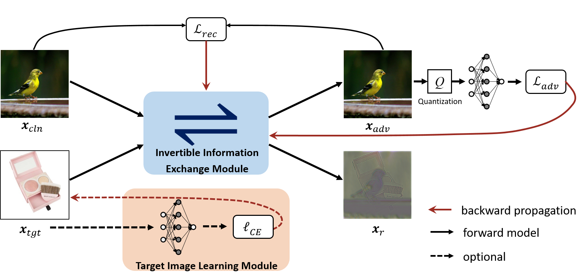

# [Imperceptible Adversarial Attack via Invertible Neural Networks](https://arxiv.org/pdf/2211.15030.pdf)

## 环境配置
假设已经安装过pytorch
```python
conda create -n advinn python=3.8
conda activate advinn
pip3 install torch torchvision torchaudio --index-url https://download.pytorch.org/whl/cu118
# python3.8
pip install scipy natsort matplotlib scikit-image lpips opencv-python
```

## 训练集下载
[点此下载](https://drive.google.com/file/d/1HHLxXVuCYNdiaXoWH3gyDvCbJSM3rWKi/view?usp=sharing)，训练集放置位置如下所示
```bash
├── AdvINN
│   ├── args.py
│   ├── config.py
│   ├── imagenet.zip
│   ├── imgs
│   ├── model
│   ├── modules
│   ├── pretrained
│   ├── __pycache__
│   ├── README.md
│   ├── recover
│   ├── train.py
│   ├── util
│   └── val_rgb_randomselect  数据集在这里
```
## 训练
```bash
python train.py
```

## quality

```bash
python util/quality.py
```


## 解析

训练开始先下载 resnet-50.pth
然后下载 vgg16.pth

训练显示
```bash
Traceback (most recent call last):
  File "train.py", line 198, in <module>
    Total_suc_rate = (count-failnum)/count
ZeroDivisionError: float division by zero
```
像是没有训练,发现 count一直为0 打印出 len(trainloader)
为0，就是说没有加载上数据


[Zihan Chen#](https://brittany-chen.github.io/)(chenzihan21@nudt.edu.cn), Ziyue Wang#, [Jun-Jie Huang*](https://jjhuangcs.github.io/) (jjhuang@nudt.edu.cn), Wentao Zhao, Xiao Liu, and Dejian Guan (#equal contribution, *corresponding author)

Pytorch implementation for "Imperceptible Adversarial Attack via Invertible Neural Networks" (AAAI'2023).



Adding perturbations via utilizing auxiliary gradient information or discarding existing details of the benign images are two common approaches for generating adversarial examples. Though visual imperceptibility is the desired property of adversarial examples, conventional adversarial attacks still generate traceable adversarial perturbations. In this paper, we introduce a novel Adversarial Attack via Invertible Neural Networks (AdvINN) method to produce robust and imperceptible adversarial examples. Specifically, AdvINN fully takes advantage of the information preservation property of Invertible Neural Networks and thereby generates adversarial examples by simultaneously adding class-specific semantic information of the target class and dropping discriminant information of the original class. Extensive experiments on CIFAR-10, CIFAR-100, and ImageNet-1K demonstrate that the proposed AdvINN method can produce less imperceptible adversarial images than the state-of-the-art methods and AdvINN yields more robust adversarial examples with high confidence compared to other adversarial attacks.


## Requisites

* PyTorch>=1.0
* Python>=3.7
* NVIDIA GPU + CUDA CuDNN

## Prepare data

Download and unzip our [dataset](https://drive.google.com/file/d/1HHLxXVuCYNdiaXoWH3gyDvCbJSM3rWKi/view?usp=sharing) which is randomly selected from ImageNet-1K, and then copy their path to ```args/inputpath```. You are also freely to run AdvINN on your dataset.

## Run

You can run ```train.py``` directly.

## Description of the files in this repository

1) ``train.py``: Execute this file to train the model 
2) ``args.py``: Image and model parameters setting 
3) ``config.py``: Hyperparameters setting
4) ``model/``: Architecture of Invertible Neural Networks
5) ``modules/``: Architecture of ACBs
6) ``pretrained/``: Pre-trained model parameters


## Citation

If you find this code and data useful, please consider citing the original work by authors:

```
@inproceedings{Chen2023AdvINN,
  title={Imperceptible Adversarial Attack via Invertible Neural Networks},
  author={Chen, Zihan and Wang, Ziyue and Huang, Jun-jie and Zhao, Wentao and Liu, Xiao and Guan, Dejian},
  booktitle={Proceedings of the AAAI Conference on Artificial Intelligence},
  volume={37},
  number={1},
  pages={414--424},
  year={2023}
}
```

